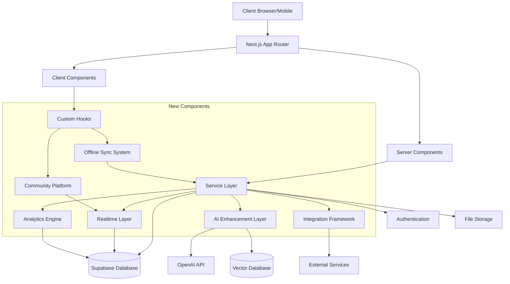

# Design Document: Modern Enhancements for Connectus

## Overview

This design document outlines the technical approach for implementing the modern enhancements to the Connectus church management system. The enhancements focus on improving user experience, adding real-time collaboration, enhancing analytics, improving mobile capabilities, expanding integrations, advancing AI features, adding community engagement tools, and optimizing performance and scalability.

The design leverages the existing Next.js 14 framework with App Router, TypeScript, React 18, Tailwind CSS, and Supabase infrastructure while introducing new technologies and patterns to achieve the modernization goals.

## Architecture

### Current Architecture

The current architecture follows a Next.js 14 App Router structure with:
- Server Components for data fetching and rendering
- Client Components for interactive elements
- Supabase (PostgreSQL) for database and authentication
- React Hooks for state management
- Service-based pattern for feature implementation
- TypeScript for type safety
- Tailwind CSS with shadcn/ui components for styling
- React Hook Form with Zod validation for form handling

### Enhanced Architecture

The enhanced architecture will maintain the core structure while adding:

1. **Real-time Layer**
   - Supabase Realtime for live updates and collaboration
   - Presence API for user status and activity tracking
   - WebSocket connections for instant messaging

2. **Analytics Engine**
   - Data warehouse for aggregated metrics
   - ETL processes for data transformation
   - Visualization layer for dashboards and reports

3. **Offline Synchronization System**
   - Enhanced IndexedDB storage with structured schema
   - Conflict resolution strategies
   - Background sync with service workers

4. **Integration Framework**
   - API gateway for external service connections
   - Webhook system for event-driven integrations
   - OAuth implementations for third-party authentication

5. **AI Enhancement Layer**
   - OpenAI integration with fine-tuned models
   - Vector database for semantic search
   - Recommendation engine for personalized experiences

6. **Community Platform**
   - Activity feeds and social interactions
   - Group management and permissions
   - Content moderation tools

### System Diagram



## Components and Interfaces

### 1. Enhanced User Experience Components

#### Dashboard Widget System
- **Interface**: `IDashboardWidget`
  ```typescript
  interface IDashboardWidget {
    id: string;
    type: WidgetType;
    title: string;
    size: 'small' | 'medium' | 'large';
    position: { x: number, y: number };
    settings: Record<string, any>;
    render(): JSX.Element;
  }
  ```

- **Component**: `DashboardGrid`
  - Drag-and-drop widget arrangement using @dnd-kit
  - Widget state persistence in user preferences
  - Responsive layout system

#### Animation and Transition System
- **Utility**: `useTransition`
  - Custom hook for managing page and component transitions
  - Integration with Framer Motion for animations

#### Form Enhancement System
- **Component**: `EnhancedForm`
  - Extension of React Hook Form with real-time validation
  - Animated feedback indicators
  - Progressive disclosure patterns

#### Mobile Experience Enhancements
- **Hook**: `useGestureDetection`
  - Custom hook for detecting swipes, pinches, and other gestures
  - Conditional rendering based on device capabilities

#### Guided Workflow System
- **Component**: `WorkflowStepper`
  - Multi-step process visualization
  - State management for workflow progress
  - Conditional paths based on user choices

### 2. Real-time Collaboration System

#### Presence System
- **Hook**: `usePresence`
  ```typescript
  interface PresenceUser {
    id: string;
    name: string;
    avatar: string;
    lastActive: Date;
    status: 'online' | 'away' | 'busy' | 'offline';
    currentView?: string;
  }
  
  const usePresence = (resourceId: string) => {
    const users: PresenceUser[];
    const updateStatus: (status: string) => void;
    const leaveResource: () => void;
  }
  ```

#### Collaborative Editing
- **Service**: `CollaborationService`
  - Integration with Y.js for CRDT-based collaboration
  - Document versioning and conflict resolution
  - Operational transformation for text editing

#### Real-time Chat
- **Component**: `ChatSystem`
  - Thread-based conversations
  - Read receipts and typing indicators
  - Media and file sharing capabilities

#### Version History
- **Interface**: `IVersionControl`
  ```typescript
  interface IVersionControl<T> {
    currentVersion: number;
    history: Array<{
      version: number;
      timestamp: Date;
      author: string;
      changes: Partial<T>;
    }>;
    revertTo: (version: number) => Promise<void>;
    compareVersions: (v1: number, v2: number) => Diff<T>;
  }
  ```

### 3. Analytics and Insights System

#### Analytics Dashboard
- **Component**: `AnalyticsDashboard`
  - Configurable metrics display
  - Date range selection
  - Export capabilities

#### Visualization Components
- **Component**: `ChartLibrary`
  - Enhanced Chart.js and Recharts implementations
  - Interactive data exploration
  - Responsive visualization sizing

#### Insights Engine
- **Service**: `InsightsService`
  ```typescript
  interface InsightResult {
    type: 'trend' | 'anomaly' | 'recommendation';
    title: string;
    description: string;
    data: any;
    confidence: number;
    actions?: Array<{
      label: string;
      action: () => void;
    }>;
  }
  
  class InsightsService {
    getInsightsForDomain(domain: string): Promise<InsightResult[]>;
    generateReport(criteria: ReportCriteria): Promise<Report>;
  }
  ```

#### Report Builder
- **Component**: `ReportBuilder`
  - Drag-and-drop report creation
  - Scheduled report generation
  - Multiple export formats (PDF, Excel, CSV)

### 4. Enhanced Mobile and Offline System

#### Offline Data Manager
- **Service**: `OfflineDataService`
  ```typescript
  class OfflineDataService {
    initialize(): Promise<void>;
    syncData(): Promise<SyncResult>;
    getOfflineData<T>(collection: string, query?: Query): Promise<T[]>;
    saveOfflineData<T>(collection: string, data: T): Promise<void>;
    resolveConflicts(conflicts: ConflictRecord[]): Promise<void>;
  }
  ```

#### Progressive Media Loading
- **Component**: `ProgressiveMedia`
  - Responsive image loading with placeholders
  - Video quality adaptation
  - Lazy loading with IntersectionObserver

#### Biometric Authentication
- **Hook**: `useBiometricAuth`
  - Integration with WebAuthn
  - Device capability detection
  - Secure credential storage

#### Push Notification System
- **Service**: `NotificationService`
  - Web Push API integration
  - Notification preferences management
  - Scheduled and triggered notifications

### 5. Integration Ecosystem

#### Integration Framework
- **Interface**: `IIntegrationProvider`
  ```typescript
  interface IIntegrationProvider {
    id: string;
    name: string;
    description: string;
    category: 'finance' | 'worship' | 'communication' | 'calendar' | 'donation' | 'other';
    authenticate(): Promise<boolean>;
    isAuthenticated(): boolean;
    getActions(): IntegrationAction[];
    getTriggers(): IntegrationTrigger[];
    executeAction(actionId: string, params: any): Promise<any>;
  }
  ```

#### OAuth Manager
- **Service**: `OAuthService`
  - Multi-provider OAuth flow management
  - Token refresh and management
  - Scoped permission handling

#### Webhook System
- **Service**: `WebhookService`
  - Webhook registration and management
  - Event triggering and payload delivery
  - Retry and failure handling

#### API Gateway
- **Service**: `APIGatewayService`
  - Rate limiting and throttling
  - Request transformation
  - Response caching

### 6. Advanced AI Assistance

#### AI Content Generator
- **Service**: `AIContentService`
  ```typescript
  interface ContentGenerationParams {
    type: 'sermon' | 'email' | 'announcement' | 'prayer' | 'study';
    topic?: string;
    length?: 'short' | 'medium' | 'long';
    tone?: 'formal' | 'conversational' | 'inspirational';
    audience?: string;
    references?: string[];
  }
  
  class AIContentService {
    generateContent(params: ContentGenerationParams): Promise<string>;
    enhanceContent(content: string, instructions: string): Promise<string>;
    summarizeContent(content: string, length: number): Promise<string>;
  }
  ```

#### Pattern Recognition System
- **Service**: `PatternAnalysisService`
  - Trend identification in member data
  - Anomaly detection for pastoral care
  - Recommendation generation based on patterns

#### AI Assistant Interface
- **Component**: `AIAssistant`
  - Contextual help system
  - Natural language query processing
  - Task automation suggestions

#### Intelligent Scheduling
- **Service**: `AISchedulingService`
  - Volunteer matching algorithm
  - Optimal scheduling suggestions
  - Conflict resolution

### 7. Community Engagement Platform

#### Social Feed System
- **Component**: `CommunityFeed`
  - Activity streams with engagement metrics
  - Content filtering and moderation
  - Rich media embedding

#### Virtual Groups
- **Service**: `GroupsService`
  ```typescript
  interface Group {
    id: string;
    name: string;
    description: string;
    type: 'small_group' | 'ministry' | 'committee' | 'class' | 'other';
    privacy: 'public' | 'private' | 'secret';
    members: GroupMember[];
    resources: Resource[];
    events: Event[];
    discussions: Discussion[];
  }
  
  class GroupsService {
    createGroup(group: Partial<Group>): Promise<Group>;
    getGroupMembers(groupId: string): Promise<GroupMember[]>;
    addMemberToGroup(groupId: string, userId: string, role?: string): Promise<void>;
    scheduleGroupMeeting(groupId: string, meeting: Meeting): Promise<Meeting>;
  }
  ```

#### Prayer Request System
- **Component**: `PrayerRequestManager`
  - Privacy controls and sharing options
  - Follow-up tracking
  - Engagement metrics

#### Video Conferencing Integration
- **Component**: `VideoMeetingRoom`
  - Integration with WebRTC
  - Screen sharing and recording
  - Virtual backgrounds

#### Volunteer Management
- **Service**: `VolunteerService`
  - Skill matching and team formation
  - Scheduling and availability tracking
  - Recognition and engagement metrics

### 8. Performance and Scalability Improvements

#### Performance Monitoring
- **Service**: `PerformanceMonitoringService`
  ```typescript
  interface PerformanceMetrics {
    pageLoadTime: number;
    timeToInteractive: number;
    apiResponseTimes: Record<string, number>;
    resourceLoadTimes: Record<string, number>;
    memoryUsage: number;
    errorRate: number;
  }
  
  class PerformanceMonitoringService {
    captureMetrics(): PerformanceMetrics;
    reportIssue(metric: keyof PerformanceMetrics, threshold: number): void;
    getPerformanceHistory(timeRange: TimeRange): Promise<PerformanceMetrics[]>;
  }
  ```

#### Adaptive Media Delivery
- **Service**: `MediaDeliveryService`
  - Adaptive bitrate streaming
  - Progressive image loading
  - Content delivery network integration

#### Data Pagination and Virtualization
- **Component**: `VirtualizedDataGrid`
  - Window-based virtualization
  - Infinite scrolling implementation
  - Data prefetching strategies

#### Caching Strategy
- **Service**: `CacheService`
  - Multi-level caching (memory, IndexedDB, HTTP)
  - Cache invalidation strategies
  - Stale-while-revalidate pattern

#### Deployment Pipeline
- **Utility**: `DeploymentConfig`
  - Blue-green deployment configuration
  - Canary releases
  - Automated rollback mechanisms

## Data Models

### Enhanced User Profile
```typescript
interface UserProfile {
  id: string;
  auth_id: string;
  display_name: string;
  email: string;
  phone_number?: string;
  profile_image_url?: string;
  roles: string[];
  departments: string[];
  preferences: {
    theme: 'light' | 'dark' | 'system';
    dashboard_layout: WidgetLayout[];
    notification_settings: NotificationPreferences;
    accessibility_settings: AccessibilitySettings;
  };
  last_active: Date;
  created_at: Date;
  updated_at: Date;
}
```

### Presence Record
```typescript
interface PresenceRecord {
  id: string;
  user_id: string;
  resource_id: string;
  resource_type: 'document' | 'page' | 'event' | 'group';
  status: 'viewing' | 'editing' | 'idle';
  last_active: Date;
  cursor_position?: { x: number, y: number };
  client_info: {
    browser: string;
    os: string;
    device_type: 'mobile' | 'tablet' | 'desktop';
  };
}
```

### Analytics Event
```typescript
interface AnalyticsEvent {
  id: string;
  event_type: string;
  user_id?: string;
  anonymous_id?: string;
  timestamp: Date;
  properties: Record<string, any>;
  session_id: string;
  page_url?: string;
  referrer?: string;
}
```

### Integration Connection
```typescript
interface IntegrationConnection {
  id: string;
  provider_id: string;
  user_id: string;
  church_id: string;
  status: 'active' | 'expired' | 'revoked' | 'error';
  credentials: {
    access_token: string;
    refresh_token?: string;
    expires_at: Date;
    scopes: string[];
  };
  settings: Record<string, any>;
  last_sync: Date;
  created_at: Date;
  updated_at: Date;
}
```

### Community Post
```typescript
interface CommunityPost {
  id: string;
  author_id: string;
  content: string;
  media_attachments: MediaAttachment[];
  visibility: 'public' | 'church' | 'group' | 'private';
  group_id?: string;
  likes: string[]; // user_ids
  comments: Comment[];
  tags: string[];
  created_at: Date;
  updated_at: Date;
}
```

### Performance Log
```typescript
interface PerformanceLog {
  id: string;
  timestamp: Date;
  user_id?: string;
  session_id: string;
  page_url: string;
  load_time: number;
  ttfb: number;
  fcp: number;
  lcp: number;
  cls: number;
  fid: number;
  resource_timing: ResourceTiming[];
  connection_info: {
    type: string;
    downlink: number;
    rtt: number;
    effective_type: string;
  };
  device_info: {
    memory: number;
    cpu_cores: number;
    device_model?: string;
    os: string;
    browser: string;
  };
}
```

## Error Handling

### Error Taxonomy
1. **Network Errors**
   - Offline detection and recovery
   - Retry strategies with exponential backoff
   - Fallback to cached data

2. **Authentication Errors**
   - Token expiration handling
   - Session recovery
   - Graceful authentication flow redirection

3. **Data Validation Errors**
   - Field-level error messages
   - Form submission prevention
   - Guided error resolution

4. **Permission Errors**
   - Clear messaging about access limitations
   - Request access workflows
   - Partial content display with permission indicators

5. **Integration Errors**
   - Third-party service status monitoring
   - Fallback mechanisms
   - Error logging and alerting

### Error Boundary Strategy
- Component-level error boundaries to prevent cascading failures
- Telemetry capture for error reporting
- User-friendly error states with recovery options

### Offline Error Management
- Queue failed operations for retry
- Conflict resolution UI for sync conflicts
- Local validation to prevent known error states

## Testing Strategy

### Unit Testing
- Component testing with React Testing Library
- Service method testing with Jest
- Mocking strategies for external dependencies

### Integration Testing
- API contract testing
- Service integration tests
- Database interaction tests

### End-to-End Testing
- Critical user flows with Cypress
- Mobile-specific scenarios
- Offline capability testing

### Performance Testing
- Load testing for concurrent users
- Response time benchmarking
- Memory usage profiling

### Accessibility Testing
- WCAG 2.1 AA compliance testing
- Screen reader compatibility
- Keyboard navigation testing

## Implementation Considerations

### Progressive Enhancement
- Core functionality without JavaScript
- Enhanced experiences with modern browser features
- Fallbacks for unsupported features

### Internationalization
- Translation infrastructure using i18n
- RTL layout support
- Locale-specific formatting

### Security Measures
- Content Security Policy implementation
- Regular security audits
- Data encryption at rest and in transit

### Privacy Compliance
- GDPR and CCPA compliance features
- Data retention policies
- User consent management

### Deployment Strategy
- Feature flags for gradual rollout
- A/B testing infrastructure
- Analytics for feature adoption monitoring